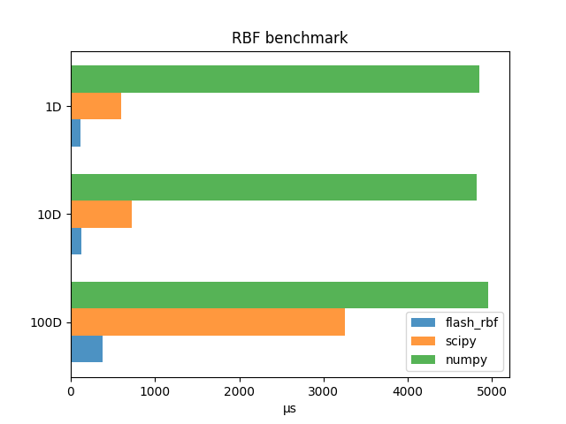
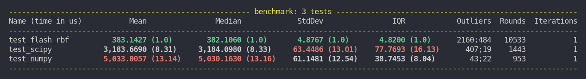

# FlashRBF
[](https://github.com/alexlovric/flash-rbf/actions/workflows/makefile.yml)

Rust library `flash_rbf_core` with python interface, which performs Radial Basis Function (RBF) interpolation. The RBF model is a type of machine learning model that's primarily used for supervised learning tasks. It's a neural network-based model that employs a specific type of activation function known as a radial basis function to transform its inputs.

# Build instructions
These instructions assume that Python3 and Cargo are installed on your system. If you are on *Windows*, you may need to install a Unix-like environment such as **Git Bash** or **Cygwin** to use Make.
To set up this project, follow these steps:
1. Clone the repository:
    ```bash
    git clone https://github.com/alexlovric/flash_rbf.git
    cd flash-rbf
    ```
2. Create a virtual environment and build release binary:
    ```bash
    make build
    ```
3. Make sure that the virtual environment is sourced if you are not using make to build:
    ```
    source .venv/bin/activate
    ```

# Testing
To run through the cargo tests:
```
make test
```

# Examples
## Using FlashRBF to interpolate
Using just the flash_rbf library to interpolate can be done as follows:

```python
import numpy as np
import flash_rbf as fl

def some_function(x):
    return x**2 + 2.0 * np.sin(2.0 * np.pi * x)

bounds = (0.1, 5.0)
x_train = np.linspace(bounds[0], bounds[1], 10)
x_train = x_train.reshape(-1, 1)
y_train = some_function(x_train)

# Train the rbf model
rbf = fl.Rbf(x_train, y_train, "gaussian", 1.0)

# Predict
x_new = np.array([0.255, 1.23, 4.6])
pred = rbf.predict(x_new)

# Update
y_new = some_function(x_new)
rbf.update(x_new, y_new)
```

# Performance 🚀
## Lightweight
With very few required dependencies, importing FlashRBF is significantly faster, for instance:
* numpy: 70ms
* scipy: 80ms
* rbf: 1.3ms

## Faster
For example the radial basis function model outperforms the scipy and numpy variations. A simple benchmark was constructed to compare this component. The benchmark involves using the same training set of 10 points (trained on the Rastrigen test function) to train an Rbf model, then predicting the response for 5 new points, then updating the model with 5 new points, and predicting once more. The mean performance of the benchmarking is shown below for a 1D, 10D, and 100D Rastrigen problem.

<div style="text-align:center">
  
</div>

More details for the 100D case are shown below:

<div style="text-align:center">
  
</div>

Note: Scipy and Numpy are not strictly using python here. By default, they use the library LAPACK, a linear algebra library (Fortran) used to solve linear systems in scipy.interpolate.Rbf. FlashRBF is using no dependencies for its Rbf interpolator, and its all in serial, so lots of room to improve on this performance. Furthermore, the overhead of interfacing between rust and python should not be ignored, its simply a lot faster in pure rust.

